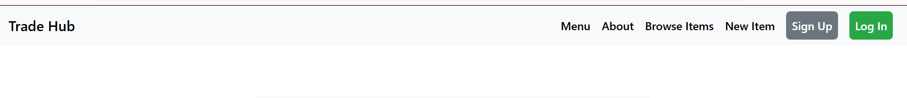
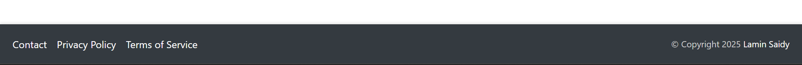
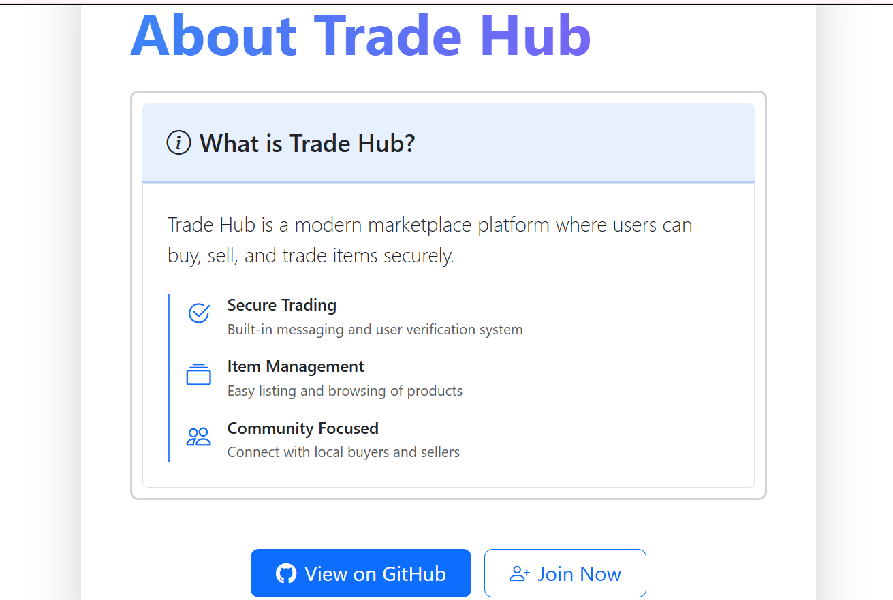
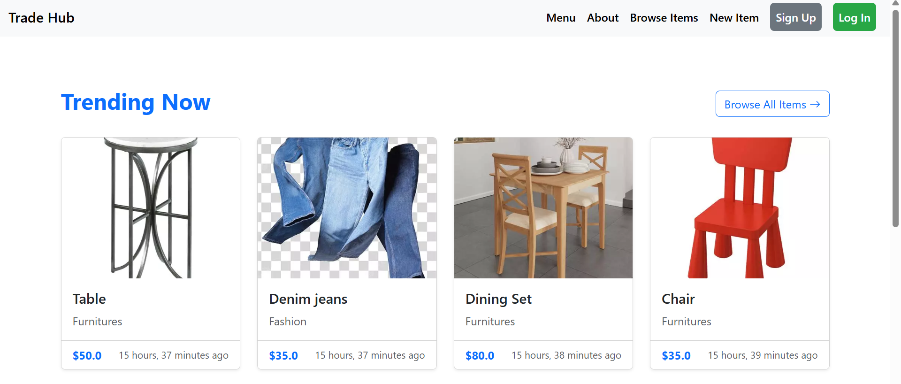
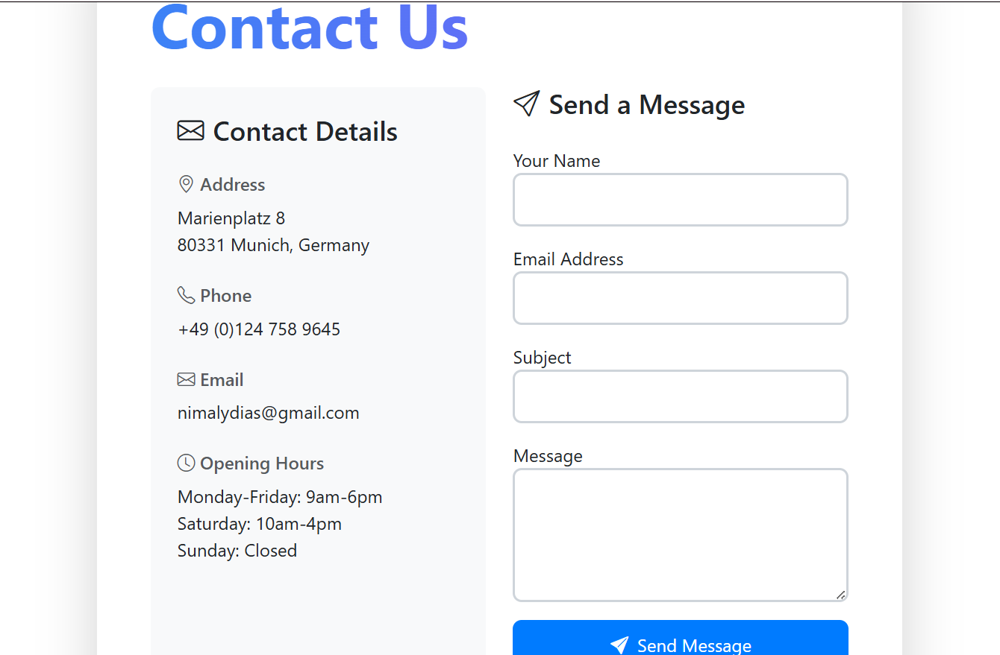
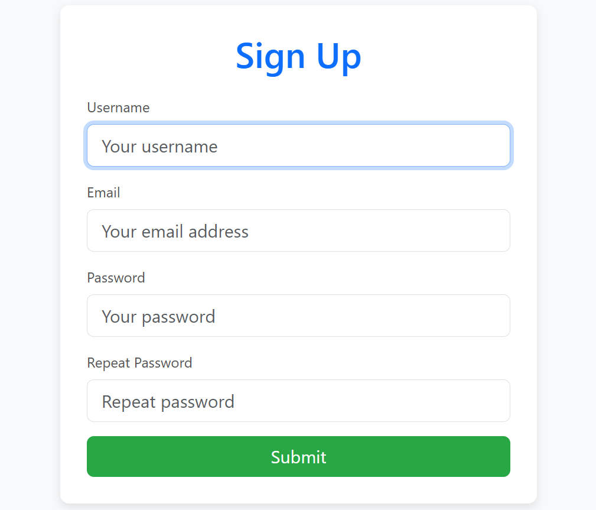
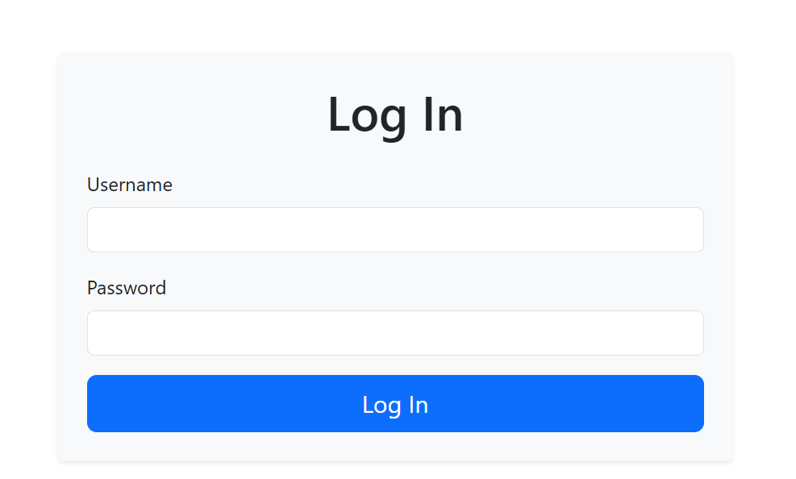
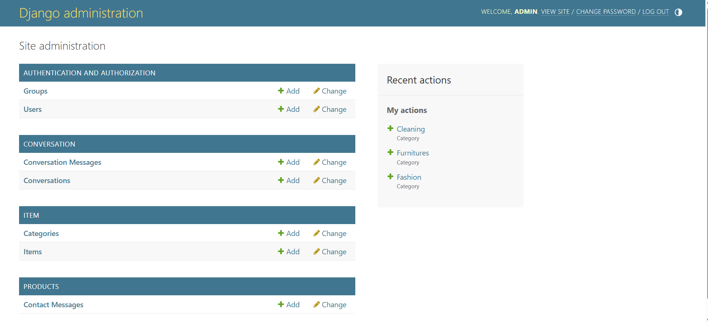
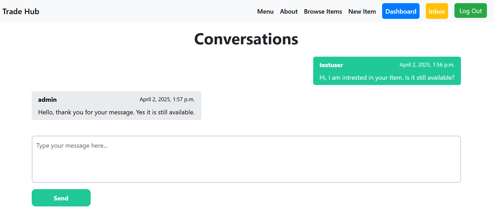

# TradeHub - Peer-to-Peer Trading Platform
## Project Overview

TradeHub is a full-stack peer-to-peer marketplace where users can sign up, search for items, upload items for sale, have their own dashboard where they can find their own items, buy items from other users/sellers by contacting them directly and trade items locally with a secure messaging within the Platform. Thre Project features:
- **User Authentication**: Secure registration and login system
- **Product Listings**: Create, browse, and manage item listings
- **Messaging System**: Built-in chat for buyer-seller communication
- **Search & Filters**: Find items by category, location, or keywords
- **User Profiles**: Manage your trading activity and reputation

##Demo

Explore the live demo: [TradeHub](https://mytradehub.onrender.com/)

# Table of Contents
1. [Project Features](#project-features)
  - [Navbar](#navbar)
  - [Footer](#footer)
  - [About Page](#home-page)
  - [Menu Page](#menu-page)
  - [Contact form](#contact-form)
  - [Sign Up Form](#sign-out-form)
  - [Sign In Form](#sign-in-form)
  - [Admin Site](#admin-site)
  - [Inbox](#inbox)
  - [User Posts Dashboard](#user-posts-dashboard)
  - [Error Page](#error-page)
2. [Target Audience](#target-audience)
3. [Design](#design)
  - [Fonts](#fonts)
  - [Structure](#structure)
4. [Frameworks](#frameworks) 
5. [Wireframes](#wireframes)
6. [Built With](#built-with)
7. [Getting Started](#getting-started)
  - [Prerequisites](#prerequisites)
  - [Installation](#installation)
8. [Testing](#testing)
9. [Bugs](#bugs)
10. [Usage](#usage)
11 [API Endpoints](#api-endpoints)
12. [Database Models](#database-models)
13. [Roadmap](#roadmap)
14. [Contributing](#contributing)
16. [Contact](#contact)
17. [Acknowledgements](#acknowledgements)

## Project Features
# Navbar
The navigation bar adapts to the current site section, providing easy access to different pages. It remains fixed at the top of the screen for convenient navigation.

# Footer
A footer which displays the Contac page, Privacy policy, Terms of service, copyrights for the website & a linkt to my Github repo.

# About
The about page introduces TradeHub's mission as a peer-to-peer trading platform. It highlights key features like secure messaging and local trading, along with team information. Users can also access a direct link to my Github project and the Sign up page. 

# Menu Page
The menu page displays the trending products for users to see the latest items directly in the page.

# Contact Form
The contact page allows users to reach out to the TradeNest support team with inquiries or feedback. It includes a form with name, email, and message fields for easy communication.

# Sign Up Form
New users can create a TradeHub account through this page. The form collects essential details including username, email, password, and location to enable local trading features.

# Signin Form
Registered users authenticate to access their TradeNest account on this page. The clean interface features email/password fields and a "Forgot Password" option.

# Admin Dashboard
The admin interface provides comprehensive management tools for platform oversight, including user management, listing moderation, and system analytics.

# Inbox Page
Users access their messaging center here to communicate with potential buyers/sellers. The interface displays conversation threads and enables real-time messaging.

# 404 Error Page
This custom error page appears when users attempt to access non-existent content, featuring helpful navigation options to return to active sections of TradeHub.

# Target Audience
TradingAppPP5 is designed for traders and investors who need a comprehensive platform to manage their trades, track market trends, and make informed decisions. The application aims to provide a user-friendly interface that caters to both beginners and experienced traders.

# Design
Fonts
Primary Font: Roboto
Secondary Font: Lato
Structure
The application follows a clean and intuitive structure, with a focus on usability and accessibility. The main sections include:

Dashboard: Overview of user activities and market trends.
Trade Management: Tools for managing trades and portfolios.
User Profile: Personalized settings and preferences.
messagin inbox: Inbox for managing conversations.

# Built With
React.js - Frontend framework
Django - Backend framework
PostgreSQL - Database
Bootstrap - CSS framework

# Getting Started
## Prerequisites
Node.js and npm installed
Python and pip installed
PostgreSQL installed
## Installation
1. Clone the repository: git clone https://github.com/laminsaidy/TradingAppPP5.git
2. Navigate to the project directory: cd TradingAppPP5
3. Install frontend dependencies: npm install
4. Install backend dependencies: pip install -r requirements.txt
5. Set up the database: python manage.py migrate
6. Start the development server: npm start, python manage.py runserver

# Bugs
If you encounter any bugs or issues, please report them in the Issues section of the repository.

# Usage
1. Signup: Create a page by signing up to become a user.
2. Signin: After signing up, you will be directed tothe sigin form.
3. Dashboard: View an overview of your trading activities and market trends.
4. Trade Management: Manage your trades and portfolios.
5. User Dashboard: Find your Items on your private user dashboard.
6. Inbox: Find new conversations from potencial buyers through the inbox.

# Models
### Category
Python:
class Category(models.Model):
    name = models.CharField(max_length=255)
- Organizes products hierarchically
- Alphabetical ordering

### Item
Python:
class Item(models.Model):
    category = models.ForeignKey(Category, on_delete=models.CASCADE)
    image = CloudinaryField('image', folder='item_images')
    is_sold = models.BooleanField(default=False)
- Stores product details
- Cloudinary-managed images
- Inventory status tracking

###  Conversation
Represents a messaging thread between users about an item

### Fields:

- item: ForeignKey to Item (related_name='conversations')

- members: ManyToManyField to User (related_name='conversations')

- created_at: DateTimeField (auto_now_add)

- modified_at: DateTimeField (auto_now)

- is_read: BooleanField (default=False, db_index=True)

### Relationships:

- One-to-Many: Messages (via ConversationMessage)

## Database Schema

### `conversation` Table
| Field        | Type      | Description                     |
|--------------|-----------|---------------------------------|
| `id`         | Integer   | Primary key                     |
| `item_id`    | Integer   | ForeignKey to `item`            |
| `created_at` | DateTime  | Thread creation time            |
| `modified_at`| DateTime  | Last message timestamp          |
| `is_read`    | Boolean   | Read status (True/False)        |

### `conversation_members` (Junction Table)
| Field             | Type    | Description                          |
|-------------------|---------|--------------------------------------|
| `id`              | Integer | Primary key                          |
| `conversation_id` | Integer | ForeignKey to `conversation`         |
| `user_id`         | Integer | ForeignKey to `auth_user`            |

### `conversationmessage` Table
| Field             | Type      | Description                          |
|-------------------|-----------|--------------------------------------|
| `id`              | Integer   | Primary key                          |
| `conversation_id` | Integer   | ForeignKey to `conversation`         |
| `content`         | Text      | Message body                         |
| `created_at`      | DateTime  | Sent timestamp                       |
| `created_by_id`   | Integer   | ForeignKey to `auth_user` (sender)   |
| `is_read`         | Boolean   | Read status (True/False)             |

