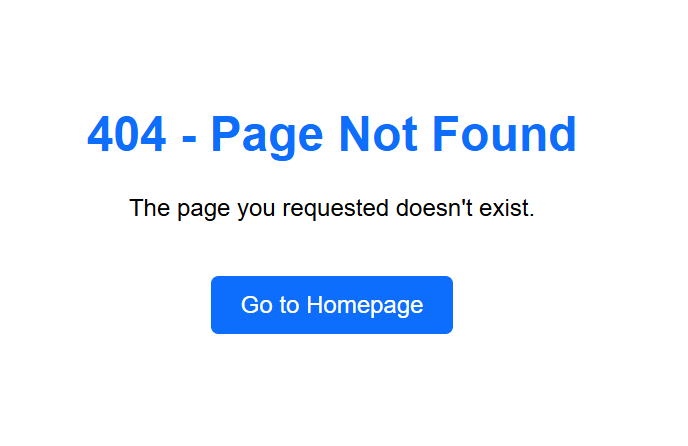

# TradeHub - Peer-to-Peer Trading Platform
## Project Overview

TradeHub is a full-stack peer-to-peer marketplace where users can sign up, search for items, upload items for sale, have their own dashboard where they can find their own items, buy items from other users/sellers by contacting them directly and trade items locally with a secure messaging within the Platform. Thre Project features:
- **User Authentication**: Secure registration and login system
- **Product Listings**: Create, browse, and manage item listings
- **Messaging System**: Built-in chat for buyer-seller communication
- **Search & Filters**: Find items by category, location, or keywords
- **User Profiles**: Manage your trading activity and reputation

##Demo

Explore the live demo: [TradeHub](https://mytradehub.onrender.com/)

# Table of Contents
1. [Project Features](#project-features)
  - [Navbar](#navbar)
  - [Footer](#footer)
  - [About Page](#home-page)
  - [Menu Page](#menu-page)
  - [Contact form](#contact-form)
  - [Sign Up Form](#sign-out-form)
  - [Sign In Form](#sign-in-form)
  - [Admin Site](#admin-site)
  - [Inbox](#inbox)
  - [User Posts Dashboard](#user-posts-dashboard)
  - [Error Page](#error-page)
2. [Target Audience](#target-audience)
3. [Design](#design)
  - [Fonts](#fonts)
  - [Structure](#structure)
4. [Frameworks](#frameworks) 
5. [Wireframes](#wireframes)
6. [Built With](#built-with)
7. [Getting Started](#getting-started)
  - [Prerequisites](#prerequisites)
  - [Installation](#installation)
8. [Testing](#testing)
9. [Bugs](#bugs)
10. [Deployment](#deployment)
11. [Future Features](#future-features)
12. [Usage](#usage)
13 [API Endpoints](#api-endpoints)
14. [Database Models](#database-models)
15. [Contributing](#contributing)
16. [Contact](#contact)
17. [Resources & Acknowledgements](#resources-acknowledgements)

## Project Features
# Navbar
**The navigation bar adapts to the current site section, providing easy access to different pages. It remains fixed at the top of the screen for convenient navigation.**


# Footer
**A footer which displays the Contac page, Privacy policy, Terms of service, copyrights for the website & a linkt to my Github repo.**


# About
**The about page introduces TradeHub's mission as a peer-to-peer trading platform. It highlights key features like secure messaging and local trading, along with team information. Users can also access a direct link to my Github project and the Sign up page.** 


# Menu Page
**The menu page displays the trending products for users to see the latest items directly in the page.**


# Contact Form
**The contact page allows users to reach out to the TradeNest support team with inquiries or feedback. It includes a form with name, email, and message fields for easy communication.**


# Sign Up Form
**New users can create a TradeHub account through this page. The form collects essential details including username, email, password, and location to enable local trading features.**


# Signin Form
**Registered users authenticate to access their TradeNest account on this page. The clean interface features email/password fields and a "Forgot Password" option.**


# Admin Dashboard
**The admin interface provides comprehensive management tools for platform oversight, including user management, listing moderation, and system analytics.**


# Inbox Page
**Users access their messaging center here to communicate with potential buyers/sellers. The interface displays conversation threads and enables real-time messaging.**


# 404 Error Page
**This custom error page appears when users attempt to access non-existent content, featuring helpful navigation options to return to active sections of TradeHub.**



# Target Audience
TradingAppPP5 is designed for traders and investors who need a comprehensive platform to manage their trades, track market trends, and make informed decisions. The application aims to provide a user-friendly interface that caters to both beginners and experienced traders.

# Design
### Research
Conducted market analysis of existing trading platforms (e.g., OfferUp, Facebook Marketplace)

Identified main points:

- Lack of secure messaging in local trading apps

- Poor item discovery based on location

- No built-in reputation systems

### Fonts
Primary Font: Roboto
Secondary Font: Lato
Structure
The application follows a clean and intuitive structure, with a focus on usability and accessibility. The main sections include:

Dashboard: Overview of user activities and market trends.
- Trade Management: Tools for managing trades and portfolios.
- User Profile: Personalized settings and preferences.
- messagin inbox: Inbox for managing conversations.

# Built With
- React.js: Frontend framework
- Django: Backend framework
- PostgreSQL: Database
- Bootstrap: CSS framework

# Getting Started
## Prerequisites
Node.js and npm installed
Python and pip installed
PostgreSQL installed
## Installation
1. Clone the repository: git clone https://github.com/laminsaidy/TradingAppPP5.git
2. Navigate to the project directory: cd TradingAppPP5
3. Install frontend dependencies: npm install
4. Install backend dependencies: pip install -r requirements.txt
5. Set up the database: python manage.py migrate
6. Start the development server: npm start, python manage.py runserver

# Bugs
If you encounter any bugs or issues, please report them in the Issues section of the repository.

# Future Features Roadmap

### High Priority
| Feature | Status | Description |
|---------|--------|-------------|
| **Escrow Payments** | Planned | Secure transaction system with 3rd-party holding |
| **Real-time Notifications** | In Design | WebSocket alerts for messages & transactions |
| **Advanced Search Filters** | Backlog | Geo-radius, price range, and condition filters |

### Medium Priority
| Feature | Status | Description |
|---------|--------|-------------|
| **User Verification** | Researching | ID verification for trusted sellers |
| **Ratings System** | Planned | 1-5 star ratings with written reviews |
| **Saved Searches** | Backlog | Email alerts for new matching items |

### Long-Term Vision
| Feature | Category | Details |
|---------|----------|--------|
| **Mobile App** | Expansion | React Native cross-platform development |
| **AI Recommendations** | ML | Personalized suggestions based on activity |
| **Subscription Tiers** | Monetization | Premium seller profiles & promotions |

# Usage
1. Signup: Create a page by signing up to become a user.
2. Signin: After signing up, you will be directed tothe sigin form.
3. Dashboard: View an overview of your trading activities and market trends.
4. Trade Management: Manage your trades and portfolios.
5. User Dashboard: Find your Items on your private user dashboard.
6. Inbox: Find new conversations from potencial buyers through the inbox.

# Models
### Category
Python
class Category(models.Model):
    name = models.CharField(max_length=255)
- Organizes products hierarchically
- Alphabetical ordering

### Item
Python
class Item(models.Model):
    category = models.ForeignKey(Category, on_delete=models.CASCADE)
    image = CloudinaryField('image', folder='item_images')
    is_sold = models.BooleanField(default=False)
- Stores product details
- Cloudinary-managed images
- Inventory status tracking

###  Conversation
Represents a messaging thread between users about an item

### Fields:

- item: ForeignKey to Item (related_name='conversations')

- members: ManyToManyField to User (related_name='conversations')

- created_at: DateTimeField (auto_now_add)

- modified_at: DateTimeField (auto_now)

- is_read: BooleanField (default=False, db_index=True)

### Relationships:

- One-to-Many: Messages (via ConversationMessage)

# Database Schema

### `conversation` Table
| Field        | Type      | Description                     |
|--------------|-----------|---------------------------------|
| `id`         | Integer   | Primary key                     |
| `item_id`    | Integer   | ForeignKey to `item`            |
| `created_at` | DateTime  | Thread creation time            |
| `modified_at`| DateTime  | Last message timestamp          |
| `is_read`    | Boolean   | Read status (True/False)        |

### `conversation_members` (Junction Table)
| Field             | Type    | Description                          |
|-------------------|---------|--------------------------------------|
| `id`              | Integer | Primary key                          |
| `conversation_id` | Integer | ForeignKey to `conversation`         |
| `user_id`         | Integer | ForeignKey to `auth_user`            |

### `conversationmessage` Table
| Field             | Type      | Description                          |
|-------------------|-----------|--------------------------------------|
| `id`              | Integer   | Primary key                          |
| `conversation_id` | Integer   | ForeignKey to `conversation`         |
| `content`         | Text      | Message body                         |
| `created_at`      | DateTime  | Sent timestamp                       |
| `created_by_id`   | Integer   | ForeignKey to `auth_user` (sender)   |
| `is_read`         | Boolean   | Read status (True/False)             |

# API Endpoints

| Endpoint                      | Method | Description                              |
|-------------------------------|--------|------------------------------------------|
| `/api/items/`                 | GET    | List all available items                 |
| `/api/items/?category=<id>`   | GET    | Filter items by category ID              |
| `/api/contact/`               | POST   | Submit contact form                      |
| `/api/conversations/`         | GET    | List user's conversations                |
| `/api/conversations/<id>/`    | GET    | Retrieve specific conversation           |
| `/api/conversations/<id>/messages/` | POST | Send new message in conversation |
| `/api/messages/<id>/`         | PATCH  | Update message (e.g., mark as read)      |

# Deployment

## App Deployment
For deploying your app, **Render** is used. Follow these steps:

### Backend Deployment (Django)

#### **1. Create a New Web Service**
- Go to the [Render Dashboard](https://dashboard.render.com/).
- Click **New Web Service** and connect your GitHub repository.

#### **2. Configure the Service**
- Choose **Python** as the environment.
- Set the **Build Command** to:
  ```sh
  pip install -r requirements.txt
  python manage.py migrate
  ```
- Set the **Start Command** to:
  ```sh
  gunicorn project_name.wsgi:application
  ```

#### **3. Set Environment Variables**
- In the "Environment" section, add the following variables:
  - `DATABASE_URL` → PostgreSQL database URL (Render provides one if using its database service).
  - `SECRET_KEY` → A strong secret key for Django.
  - `CLOUDINARY_URL` → If using Cloudinary for media storage.

#### **4. Configure PostgreSQL Database (Optional)**
- If you need a database, create a **New PostgreSQL Database** in Render.
- Copy the **Database URL** and add it to the environment variables.

#### **5. Allow Hosts & Static Files**
- In `settings.py`, set:
  ```python
  ALLOWED_HOSTS = ['your-render-app.onrender.com']
  ```
- Configure static files:
  ```python
  STATIC_URL = '/static/'
  STATIC_ROOT = os.path.join(BASE_DIR, 'staticfiles')
  ```

#### **6. Deploy**
- Click **Create Web Service** and wait for the deployment to complete.

---

### Frontend Deployment (React)

#### **1. Create a New Static Site**
- In the Render Dashboard, click **New Static Site**.
- Connect your React repository.

#### **2. Configure the Service**
- Set the **Build Command** to:
  ```sh
  npm install && npm run build
  ```
- Set the **Publish Directory** to:
  ```sh
  build
  ```

#### **3. Add Environment Variables (Optional)**
- If using environment variables in React, add them in the Render Dashboard under **Environment**.

#### **4. Deploy**
- Click **Create Static Site** and wait for the deployment.

---

## Version Control
To manage version control and push code to GitHub, follow these steps:

#### **1. Add Changes**
```sh
git add .
```

#### **2. Commit Changes**
```sh
git commit -m "Your commit message"
```

#### **3. Push to GitHub**
```sh
git push origin main
```

---

### Notes:
- Render automatically redeploys when you push changes to GitHub.
- Monitor logs in the Render dashboard for debugging deployment issues.
- Set up a custom domain in Render if needed.

Your Django backend and React frontend should now be successfully deployed on Render!


# Contributing
1. Fork the repository

2. Create your feature branch (git checkout -b feature/AmazingFeature)

3. Commit your changes (git commit -m 'Add some AmazingFeature')

4. Push to the branch (git push origin feature/AmazingFeature)

5. Open a Pull Request

# Contact
Lamin Saidy nimalydias@gmail.com

Project Link https://github.com/laminsaidy/TradingAppPP5

# Resources & Acknowledgements

### Core Development
| Resource | Version | Usage |
|----------|---------|-------|
| [Django](https://docs.djangoproject.com/) | 4.2 | Backend framework |
| [Django REST Framework](https://www.django-rest-framework.org/) | 3.14 | API endpoints |
| [PostgreSQL](https://www.postgresql.org/docs/) | 14 | Database (with PostGIS) |
| [Python](https://docs.python.org/3/) | 3.10 | Runtime environment |

### Frontend & UI
| Resource | Version | Usage |
|----------|---------|-------|
| [Bootstrap](https://getbootstrap.com/) | 5.3 | Responsive layouts |
| [Google Maps API](https://developers.google.com/maps/documentation) | v3.55 | Location features |
| [Cloudinary](https://cloudinary.com/documentation) | 1.36 | Image management |
| [jQuery](https://api.jquery.com/) | 3.7 | Interactive elements |

### Project Setup
| Resource | Usage |
|----------|-------|
| [GitHub Actions](https://docs.github.com/en/actions) | CI/CD pipelines |
| [Render](https://render.com/docs) | Deployment and hosting |
| [Docker](https://docs.docker.com/) | Containerization |

### Learning Resources
- [Django for Beginners](https://djangoforbeginners.com/) - Project structure
- [Render deployment guide](https://render.com/docs/deploy-django) - Deployment Guide
- [Real Python](https://realpython.com/) - Authentication help
- [MDN Web Docs](https://developer.mozilla.org/) - JavaScript guidance

### Special Thanks
- **CodeInstitute** [Code Institute:](https://codeinstitute.net/)
- **My friend who works as a senior software developer Pedram**
- **Stack Overflow Community** - Debugging solutions
- **DigitalOcean Tutorials** - Server optimization
- **Django Discord** - Architecture advice
